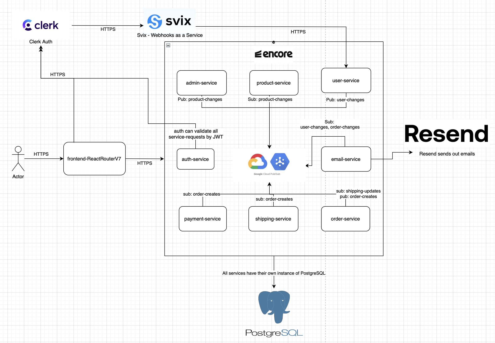
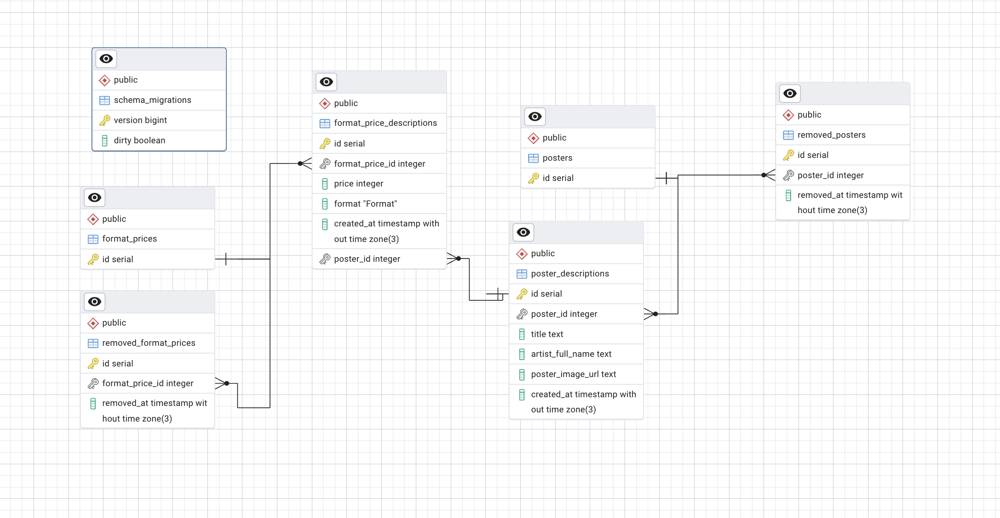
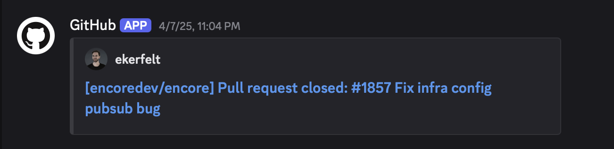
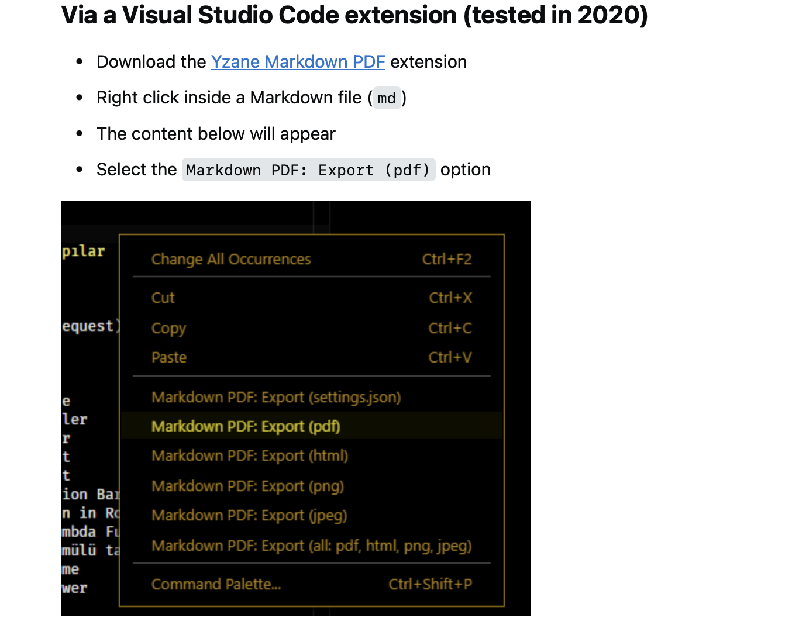

# Devlopment of Large Systems & Full Stack Web dev - antik-moderne

## Project & Team

[Github Project](https://github.com/realkoder/antik-moderne-dls-encore)

[Alexander Christensen](https://github.com/realkoder)

[Emil Aalund](https://github.com/emailKolar)

[Mikkel René Johansen](https://github.com/)

<br>

## Project Management

We adopt the **SCRUM framework** to efficiently manage our development process and quickly respond to changes. We want to use this agile methodology that emphasizes iterative and incremental approaches, allowing flexibility while focusing on delivering customer value.

> This is our attended approach

- Configure a **SCRUM backlog** as a dynamic, prioritized list of features and tasks that evolve as our project progresses. We will be using Jira to manage this backlog, enabling easy addition, prioritization, and updates.

- **Sprint** fixed period (typically two weeks) during which specific tasks are completed and prepared for review. It is a time-boxed effort.

- **Sprint backlog** consists of tasks selected from the SCRUM backlog for the current sprint, determined during sprint planning. It is managed in Jira, with tasks assigned to the team.

- **Sprint planning** is a meeting at the start of each sprint where the team selects tasks based on priority, goals, and capacity. This sets the direction for the sprint.

- We use _Jira_ to manage both the SCRUM and sprint backlogs. Its features allow us to create user stories, plan sprints, track issues, and report progress, enhancing visibility and collaboration among team members and stakeholders.

<br>

---

<br>

### Branch Strategy

`Main` &larr; `develop` &larr; `feature` &larr; `developersFeature`

## Project – antik-moderne

Our e-commerce platform is a comprehensive online marketplace designed to facilitate the buying and selling of posters across various genres, including animal, art, artists, music, etc. The platform's architecture is informed by key requirements in the areas of functionality, usability, reliability, performance, and supportability. Notably, the platform features user account management, secure payment processing, and robust search functionality, as well as a responsive design and compliance with accessibility standards. The system's reliability is ensured through regular data backups, user-friendly error handling, and a high-availability infrastructure. With a focus on scalability and performance, the platform is designed to support a large user base and high volumes of traffic, making it an ideal case study for exploring the complexities of e-commerce system design and development.

<br>

---

<br>

## Requirements

### Functional Requirements

**User Accounts and Product Browsing**

- Users should be able to create accounts, log in, and manage their profiles.
- Password recovery and email verification functionalities.
- Users can filter posters by genre, size, price range, and popularity.
- Search functionality with autocomplete suggestions.

**Shopping Cart & Checkout Process**

- Users can add, remove, and update quantities of posters in their shopping cart.
- Display estimated shipping costs and taxes in the cart.
- Secure payment gateway integration (e.g., PayPal, Stripe).
- Option for guest checkout without account creation.

**Order Management**

- Users can view order history and track current orders.
- Admin can manage orders, update statuses, and handle returns or exchanges.

**Reviews and Ratings & Wishlist Feature**

- Users can leave reviews and ratings for posters.
- Admin can moderate reviews to ensure appropriateness.
- Users can save posters to a wish list for future purchases.

**Usability Requirements**

- The website should be mobile-friendly and accessible on various devices.
- Intuitive navigation and layout for easy browsing.

**Reliability Requirements**

- Regular backups of user data and product information to prevent data loss.
- User-friendly error messages and logging for system errors.
- Ensure high availability with minimal downtime, ideally 99.9% uptime.

**Performance Requirements**

- Pages should load within 2 seconds under normal conditions.
- Support for at least 1000 concurrent users without performance degradation.
- The architecture should allow for easy scaling as the user base grows.

**Supportability Requirements**

- Comprehensive user manuals and API documentation for developers.
- Integration of a support ticket system and live chat for customer inquiries.
- Implement monitoring solutions to track system performance and user behavior.

<br>

---

<br>

## System Architecture design

**Micro-service architecture**



The whole project is organzied as a _mono-repo_ with two directories: `backend` & `frontend`. The backend system consists of following micro-services: `admin-service` `auth-service` `email-service` `product-service`.

For the backend **[Encore](https://encore.dev)** is used as a backend framework and frontend is builded with [React Router v7](https://reactrouter.com/home).
Encore is a newer backend development framework designed to streamline creation, deployment and maintenance of cloud-native applications. It's based on a high-performance [Rust runtime](https://encore.dev/docs/ts/concepts/benefits), _Rust_ focus on safety and concurrency enables _Encore_ to offer a high-performance runtime environment that is both fast and reliable.

Encore supports _TypeScript_ out of the box. This integration enhances code quality and developer productivity by catching errors early in the development process. Further more _Encore_ provides a super efficient feature which is this script for frontend _package.json_ `"gen": "encore gen client backend-2tui --output=./app/lib/client.ts --env=local"`. This scripts generates all the callable API endpoints for the given services with typesafe input outputs.

_Encore_ provides built-in support for service-to-service communication through its pub/sub system. This feature allows services within the Encore application to publish and subscribe to events, facilitating loose coupling and enhancing the system's scalability and maintainability. This [pub/sub](https://encore.dev/docs/platform/infrastructure/infra) is implemented by the use of [GCP](https://cloud.google.com/pubsub) which is a realtime distributed messaging platform just like _RabbitMQ_, _Kafka_ etc.

#### Key Features of Encore's Pub/Sub System:

- **Type-Safe Communication:** Ensures that messages passed between services adhere to predefined types, improving code reliability and developer experience.
- **Scalable Architecture:** Designed to support a growing number of services and messages, making it suitable for both small and large applications.
- **Decoupled Services:** Services can communicate without direct knowledge of each other, promoting a modular architecture.
- **Built-in Reliability:** Offers mechanisms such as retry policies and dead-letter queues to handle message delivery failures gracefully.

By leveraging Encore's pub/sub system, `antik-moderne` ensures efficient and reliable inter-service communication, laying the foundation for a robust and scalable e-commerce platform.

#### Authorization outsourced to Clerk

We have choosen to use [Clerk](https://clerk.com/docs) for user creation and signup. It can be a true struggle to enhance _SSO / OAuth Protocol / OpenID_ on your own and especially _Apple single-sign-on_ [setup Apple sign in](https://www.kyle-melton.com/blog/2022-02-how-to-setup-sign-in-with-apple) since _Apple SSO_ only accepts https connections which mean you have to configure _nginx reverse proxy_ for local dev experience. ALl this is [Clerk social connection](https://clerk.com/docs/authentication/social-connections/oauth#configuration) dealing with, and they do also provide custom user handling with the use of webhook calling with [Svix](https://www.svix.com) - so we are also persisting our users.

<br>

### Database and use of Typescript ORM Prisma

There exists a lot of different Typescript ORM's but we have chosen to work with _Prisma_ since it's proudction ready state, it supports migrations, it has a very declarative data modeling and an intuitive API to improve developer performance.

The database is using the **Tombstone Pattern**, where data is never permanently deleted. Instead, it is moved to a corresponding "removed" table for a given data model see _product-service_.
Additionally, the **Snapshot Pattern** is employed too, ensuring that data is never overwritten see also _product-service_. Each change creates a new version within _poster_snapshots_ table before updating the _poster_ table instance of the data, preserving the history of all modifications.

Commands to configure _Prisma_

```bash
# Install prisma
npm install prisma --save-dev

# To get the shadow db connection url to Encore.ts shadow database, run:
encore db conn-uri <database name> --shadow

# To initialize Prisma, run the following command from within your service folder:
npx prisma init --url <shadow db connection url>

# To execute a new migration regarding changes by DDL
npx prisma migrate dev --name <short_descriptive_name>
```

[Encores Prisma docs](https://encore.dev/docs/ts/develop/orms/prisma)
[Encores Prisma github example](https://github.com/encoredev/examples/tree/main/ts/prisma)

#### ERD Products db - implementing snapshot and tombstone pattern



---

### Frontend

**React Router v7**: We've chosen React Router v7 for its dynamic routing capabilities in React applications. This version brings significant improvements in terms of performance and flexibility, allowing us to implement complex routing scenarios with ease. It supports both SSR and CSR, enabling us to optimize our application for performance and SEO.

**TypeScript** is used throughout our frontend codebase for its strong typing system. This not only helps in catching errors early in the development process but also improves the overall maintainability and readability of the code. TypeScript's compatibility with React and its ecosystem makes it an ideal choice for our project.

**TailwindCSS** for styling, we've adopted TailwindCSS with its default configuration. TailwindCSS's utility-first approach allows us to rapidly design custom interfaces without stepping away from our code editor. Its configuration-first philosophy means we can customize the framework to fit our design needs perfectly, ensuring consistency and scalability in our design system.

**Server-Side Rendering (SSR) & Client-Side Rendering (CSR)**: Our application supports both SSR and CSR, leveraging the best of both worlds. SSR enhances our application's performance and SEO, serving pre-rendered pages to the browser. CSR, on the other hand, ensures dynamic interactions and a smooth user experience. This dual approach allows us to cater to a wide range of user devices and network conditions, ensuring accessibility and efficiency.

By integrating these technologies, our frontend architecture is designed to be flexible, efficient, and scalable, supporting the complex needs of our e-commerce platform while providing an excellent developer experience.

<br>

---

<br>

### Dev environment

Since we use **Encore** as backend framework, encore have a super efficient and elegant dev-experience to boot up whole backend system (dev-exp for frontend is described below):

```bash
# Given you're placed in root
cd backend

# If first time whole project have to have needed dependencies installed
npm install

# given you have configured encore -> https://encore.dev/docs/ts/install
encore run
```

Frontend application for dev-exp:

```bash
# Given you're placed in root

cd frontend

# If first time whole project have to have needed dependencies installed
npm install

npm run dev
```

If you gonna experiement with [Clerk usage of Webhooks](https://clerk.com/docs/webhooks/overview?_gl=1*j9cbt9*_gcl_au*MTQwNDI0MjU0Mi4xNzM5ODA1MTE5*_ga*OTAyMzMwOTQ3LjE3Mzk4MDUxMTk.*_ga_1WMF5X234K*MTc0MDMyNjM4OS4xMC4xLjE3NDAzMjc4ODUuMC4wLjA.):

```bash
# Ensure you have instaled ngrok
ngrok http --url=sharp-moth-exciting.ngrok-free.app 4000
```

<br>

---

<br>

### Deployment

Frontend deployed through _Vercel_
Backend is deployed with _Encore_ in staging env, since that's free.

[Deployed app](https://antik-moderne-dls-encore.vercel.app)

<br>

---

<br>

### Self hosting
Spend a lot of time figurering out the GHCR access - took me hours to figure out that we wasn't allowed to have the repo name in image like _ghcr.io/antik-moderne/frontend-app_ but it should contain the github repo owners username....

This was the cryptic error we were stuck with, since it didn't say anything about bad naming convention for the push command:

```bash
ERROR: failed to solve: failed to push ghcr.io/antik-moderne/frontend-app:latest: unexpected status from POST request to https://ghcr.io/v2/antik-moderne/frontend-app/blobs/uploads/: 403 Forbidden
Error: buildx failed with: ERROR: failed to solve: failed to push ghcr.io/antik-moderne/frontend-app:latest: unexpected status from POST request to https://ghcr.io/v2/antik-moderne/frontend-app/blobs/uploads/: 403 Forbidden
```

Relevant kubectl commands:

```bash
# Check kubernetes cluster status
kubectl cluster-info

# Check nodes status
kubectl get nodes

# Check pods status
kubectl get pods --all-namespaces

# Creatig the configmap  based on .env.production
kubectl create configmap frontend-env --from-env-file=frontend/.env.sample

# Apply deployment and service files
kubectl apply -f k8s/frontend/deployment.yml
kubectl apply -f k8s/frontend/service.yml
```


### Self Hosting ReactRouter-v7 applications

_ReactRouterv7_ comes out of the box with prebuilt _Dockerfile_. to build container image follow on:

```bash
# Ensure to be placed inside /frontend
docker build -t frontendapp .

# Start the container with .env.production file
docker run -d --env-file .env.production -p 3000:3000 --name frontendapp frontendapp
```

The docker image is making use of the npm scripts `build & start` where the start script is using `dotenv-cli` to set the environment variables from .env.production env-file.

```json
  "scripts": {
    "build": "react-router build",
    "start": "dotenv -e .env.production -- react-router-serve ./build/server/index.js",
  }
```


### Self Hosting Encore applications

With __Encore__ applications, a lot happens behind the scenes, which means many features come out of the box, such as pub/sub messaging, database setup with migration logic, testing automation, and gatekeeper servicing. To run in production and ensure everything operates smoothly, your setup may depend on __Encore__, which can be costly. Therefore, they provide the option to self-host. This is accomplished by using the command `encore build docker`, which allows you to either package the entire __Encore__ application into a single Docker image or dockerize each specific service individually.
To build the Encore application with Docker, it requires an **infra-config.json** file to specify dependencies such as databases, environment variables, and pub/sub configurations.

```bash
# Command to build whole encore app in one docker image
encore build docker --base=node:20-bullseye --config infra-config.json --arch=arm64 antikmoderne:v1
```


<br>

---

<br>

## Bonus links and miscellaneous

_PostgreSQL_ is used as databasse - where _[Drizzle](https://orm.drizzle.team)_ is used as _ORM_.

[Encore example with PostgreSQL and Drizzle as ORM](https://github.com/encoredev/examples/blob/main/ts/drizzle/README.md)

[Clerk React SDK + Encore App Example](https://github.com/encoredev/examples/blob/main/ts/clerk/admin/admin.ts)

[Stackoverflow about issues with migrating to Tailwindcss v4](https://stackoverflow.com/questions/79380514/problem-installing-tailwindcss-with-vite-after-npx-tailwindcss-init-p-comman/79380522#79380522)

[React spinners components](https://github.com/adexin/spinners-react)



### NOTES

For the authentication following is used: **clerk**, **svix** & **ngrok**.
Clerk is handling the signin with either google / apple or manual signup. _Svix_ is what _Clerk_ uses for their webhooks.

[Guide for configuring webhooks](https://clerk.com/docs/webhooks/sync-data)

Using _ngrok_ for exposing local running encore services where /users/webhook is relevant to make webhook listening for incomming requests when user: **creates**, **updates** or **deletes**.

[ngrok to expose local running endpoints used for clerk/svix webhook when new users or users updates or deletes](https://dashboard.ngrok.com/get-started/setup/macos)
execute this to expose: `ngrok http --url=sharp-moth-exciting.ngrok-free.app 4000`
